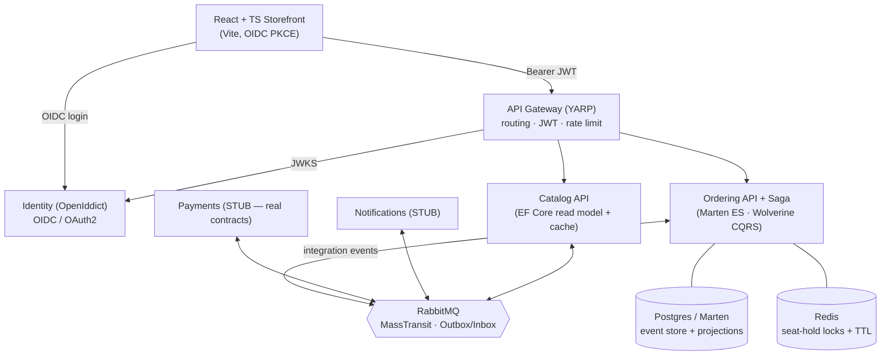

# Seatwise

> An event-sourced ticket-booking platform that proves **zero oversell under concurrent load**.

[](https://github.com/jarciN0/seatwise/actions/workflows/ci.yml)
[](LICENSE)


## Problem — what & why

When two customers grab the **same seat in the same millisecond**, exactly one
must win and the other must get a clean "seat taken" — never a double-booking,
never money taken for a seat that doesn't exist. That canonical race (with money
on the line) is the hardest part of any booking system, and it's where
distributed-systems engineering earns its keep.

Seatwise exists to prove one claim, measurably:

> Under a k6 load test firing **N** concurrent reservation requests at a venue
> with **M < N** seats, **exactly M** seats are sold, **0** are oversold, and
> p95 hold latency stays under target — verifiable from a committed test report
> and a Grafana screenshot.

## Architecture



## Key decisions / trade-offs

- **Event sourcing for Ordering only** — the booking's history *is* the business
  asset and audit log; Catalog/Identity have no such need. ([ADR-0001](docs/adr))
- **Three-layer concurrency model** — a short-lived per-seat Redis lock + a TTL'd
  hold record + optimistic-concurrency event appends. We never hold the lock for
  the whole 120s. ([ADR-0003](docs/adr))
- **Outbox/Inbox over 2PC** — atomic DB-commit + publish without distributed
  transactions; effectively-once delivery. ([ADR-0004](docs/adr))
- **YAGNI: RabbitMQ, not Kafka** — at booking scale Kafka's machinery is
  operational overhead we don't need. ([ADR-0005](docs/adr))
- **Licensing-aware stack** — MediatR / AutoMapper / MassTransit v9 went
  commercial in 2025–26; we use **Wolverine** (OSS), pin **MassTransit 8**
  (Apache-2.0), and avoid AutoMapper. ([ADR-0010](docs/adr))

> Full concept and 3-pass design: [`plans/01-microservices.md`](https://github.com/jarciN0/seatwise) (the blueprint this repo is built from).

## Quickstart

```bash
# 1. Bring up infrastructure (Postgres, RabbitMQ, Redis)
docker compose up -d

# 2. Build + test
dotnet build
dotnet test

# 3. Run the crown-jewel service
dotnet run --project src/Seatwise.Ordering.Api
# -> GET http://localhost:5101/health
# -> POST http://localhost:5101/orders/holds  (header: Idempotency-Key)
```

## Screenshot / GIF

🚧 _The headline artifact — a side-by-side of the k6 oversell run and the Grafana
"sold vs capacity" panel flatlining at capacity — lands with milestone M5._

## Tech stack

| Concern | Choice |
|---|---|
| Runtime | .NET 10 |
| Web | ASP.NET Core Minimal APIs |
| Gateway | YARP |
| In-proc CQRS | Wolverine (OSS — not MediatR) |
| Messaging | MassTransit 8 (Apache-2.0) + RabbitMQ |
| Event store | Marten on PostgreSQL |
| Read sides | EF Core (Npgsql) |
| Locks / holds | Redis (RedLock) |
| Identity | OpenIddict (OIDC/OAuth2) |
| Tests | xUnit + FluentAssertions 7 + NSubstitute; Testcontainers; k6 |
| Frontend | React 19 + TypeScript + Vite |

## Testing

```bash
dotnet test                          # unit tests (Order aggregate state machine)
# TODO(M5): k6 run tests/load/oversell.js   — the headline oversell proof
# TODO(M6): Testcontainers integration tests (Postgres + RabbitMQ + Redis)
```

Coverage gate target: **≥85%** (concentrated on the Ordering domain + saga).

## Roadmap / status

**🚧 Building in the open.** This is a rough but real scaffold, not the finished slice.

- ✅ Solution structure, CPM, CI skeleton, AI-FIRST layer
- ✅ Event-sourced **Order** aggregate (Hold → Reserve → Confirm, expiry/cancel) + unit tests
- ✅ Ordering API with Marten + Wolverine wired; 3 core endpoints
- 🚧 M4/M5: Redis hold record + RedLock + the k6 oversell proof
- 🚧 M6: MassTransit saga + outbox/inbox; Payments/Notifications behavior
- 🚧 M1/M2: Identity client seeding + Gateway JWT validation
- 🚧 M3: Catalog endpoints + seat-map cache
- 🚧 M7: OpenTelemetry + Grafana/Loki/Tempo dashboards
- 🚧 M8: React storefront (seat map + hold countdown)

See [`plans/01-microservices.md`](https://github.com/jarciN0/seatwise) for the full milestone plan (M0–M9).
