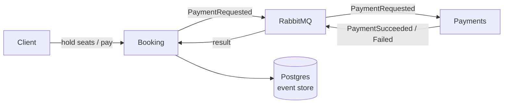

# seatwise

> A small flight-seat booking backend that **never overbooks a seat, even under load** — built as a reusable base for any seat-inventory booking (airlines, trains, events).

🚧 **Building in the open.** The booking flow, the no-overbooking guarantee, the payment saga, and hold expiry all work end-to-end via `docker compose`. Next up: a thin web UI and a load-test script.

[](LICENSE)


## What it is

Two small services that together let a customer book seats on a flight:

- **Booking** (`Seatwise.Ordering.Api`) — browse flights, hold seats, pay, get a booking. Stores each booking as a stream of events (Marten event sourcing on Postgres).
- **Payments** (`Seatwise.Payments.Api`) — a mock card processor.

They talk to each other only by sending messages over **RabbitMQ** (using Wolverine), so each could be deployed and scaled on its own.

The domain is flights, but nothing is flight-specific in the booking logic — swap the seed data and it's a base for trains, events, or any "limited seats, must not oversell" product.

## The interesting part: no overbooking

When you hold seats, the Booking service inserts one row per seat with the primary key `flightId:seat`. Because a primary key is unique, two people trying to grab seat `1A` at the same instant can't both succeed — the database rejects the second insert and that customer gets a `409`. No locks, no Redis, just the database doing what it's good at.

## How it flows



1. Hold seats → seats reserved for 120 seconds.
2. Check out → Booking asks Payments to charge the card (over RabbitMQ).
3. Payments replies → Booking either **confirms** the booking and issues tickets, or **cancels** it and frees the seats.
4. If nobody pays in time, a background job expires the hold and frees the seats.

## Run it

```bash
docker compose up --build
```

Then open **http://localhost:8081/swagger**. Three sample flights are seeded automatically (the `XX001` "demo" flight has only 3 seats, which makes the no-overbooking behaviour easy to see). RabbitMQ's UI is at http://localhost:15673 (guest/guest).

### Try the whole flow with curl

```bash
B=http://localhost:8081
DEMO=33333333-3333-3333-3333-333333333333

# hold two seats
curl -X POST $B/bookings -H "Content-Type: application/json" \
  -d "{\"flightId\":\"$DEMO\",\"customerRef\":\"alice\",\"seats\":[\"1A\",\"1B\"]}"

# someone else tries seat 1A -> 409 Conflict (no overbooking)
curl -i -X POST $B/bookings -H "Content-Type: application/json" \
  -d "{\"flightId\":\"$DEMO\",\"customerRef\":\"bob\",\"seats\":[\"1A\"]}"

# pay (any card not ending 0000 succeeds; 0000 is declined) then read the booking
curl -X POST $B/bookings/<bookingId>/checkout -H "Content-Type: application/json" -d '{"cardLast4":"4242"}'
curl $B/bookings/<bookingId>     # status: Confirmed, with ticket codes
```

## Tech

| Piece | Choice | Why |
|---|---|---|
| Runtime | .NET 10, Minimal APIs | small, fast HTTP |
| Event store | Marten (Postgres) | bookings stored as events |
| Messaging | Wolverine + RabbitMQ | services talk asynchronously |
| Tests | xUnit + FluentAssertions | the booking rules, tested in memory |

We deliberately **don't** use MediatR, AutoMapper, or MassTransit v9 — they became paid products in 2025–26 ([ADR-0010](docs/adr/0010-licensing-aware-dependencies.md)). Wolverine covers both in-process and cross-service messaging.

## Tests

```bash
dotnet test
```

---
Part of [my portfolio](https://github.com/jarciN0). Built AI-first — see [`CLAUDE.md`](CLAUDE.md).
